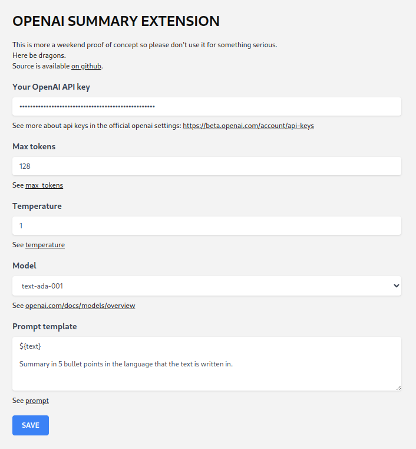

# OpenAI summarize articles extension

**Note**: this is the result of an afternoon project so expect bugs, bad code and frequent changes.

## Features


- Browser popup that scans the current page for articles
- Run article text through an [OpenAI text completion call](https://beta.openai.com/docs/guides/completion)

## Configuration

- after installing the extension, open the extension settings
- you **must** set an OpenAI api key for this extension to work
- you can fine tune all the other configuration values as needed



## Development

- the whole project is based on https://github.com/abhijithvijayan/web-extension-starter/

- `yarn install` to install dependencies.
- To watch file changes in development

  - Chrome
    - `yarn run dev:chrome`
  - Firefox
    - `yarn run dev:firefox`
  - Opera
    - `yarn run dev:opera`

- **Load extension in browser**

- ### Chrome

  - Go to the browser address bar and type `chrome://extensions`
  - Check the `Developer Mode` button to enable it.
  - Click on the `Load Unpacked Extension…` button.
  - Select your browsers folder in `extension/`.

- ### Firefox

  - Load the Add-on via `about:debugging` as temporary Add-on.
  - Choose the `manifest.json` file in the extracted directory

- ### Opera

  - Load the extension via `opera:extensions`
  - Check the `Developer Mode` and load as unpacked from extension’s extracted directory.

### Production

- `yarn run build` builds the extension for all the browsers to `extension/BROWSER` directory respectively.

Note: By default the `manifest.json` is set with version `0.0.0`. The webpack loader will update the version in the build with that of the `package.json` version. In order to release a new version, update version in `package.json` and run script.

If you don't want to use `package.json` version, you can disable the option [here](https://github.com/abhijithvijayan/web-extension-starter/blob/e10158c4a49948dea9fdca06592876d9ca04e028/webpack.config.js#L79).

### Generating browser specific manifest.json

Update `source/manifest.json` file with browser vendor prefixed manifest keys

```js
{
  "__chrome__name": "SuperChrome",
  "__firefox__name": "SuperFox",
  "__edge__name": "SuperEdge",
  "__opera__name": "SuperOpera"
}
```

if the vendor is `chrome` this compiles to:

```js
{
  "name": "SuperChrome",
}
```

---

Add keys to multiple vendors by separating them with | in the prefix

```
{
  __chrome|opera__name: "SuperBlink"
}
```

if the vendor is `chrome` or `opera`, this compiles to:

```
{
  "name": "SuperBlink"
}
```

See the original [README](https://github.com/abhijithvijayan/wext-manifest-loader) of `wext-manifest-loader` package for more details

## Bugs

Please file an issue [here](https://github.com/abhijithvijayan/web-extension-starter/issues/new) for bugs, missing documentation, or unexpected behavior.

### Linting & TypeScript Config

- Shared Eslint & Prettier Configuration - [`@abhijithvijayan/eslint-config`](https://www.npmjs.com/package/@abhijithvijayan/eslint-config)
- Shared TypeScript Configuration - [`@abhijithvijayan/tsconfig`](https://www.npmjs.com/package/@abhijithvijayan/tsconfig)

## License

MIT © [Abhijith Vijayan](https://abhijithvijayan.in)
